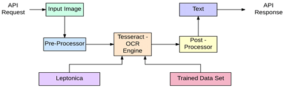

# OCR-Vision

This is a simple OCR (Optical Character Recognition) application built using Streamlit and Tesseract. The application allows users to upload images or PDF files and extracts text from them.

## Features ✨

- **Upload and process images** (PNG, JPG, JPEG).
- **Upload and process PDF files**.
- **Display the uploaded image or PDF**.
- **Extract and display text** from the uploaded files using Tesseract OCR.
- **User-friendly interface** with Streamlit.
- **Fast and accurate text extraction**.
- **Cross-platform support** (Windows, macOS, Linux).

## About Tesseract 🔮

[Tesseract](https://github.com/tesseract-ocr/tesseract) is one of the most accurate open-source OCR engines available today. Developed by HP and currently maintained by Google, Tesseract has support for multiple languages and can recognize over 100 different languages. It uses machine learning techniques, including LSTM (Long Short-Term Memory) neural networks, for text recognition.

### Key Features of Tesseract:

- **Open Source**: Tesseract is available under the Apache License 2.0, making it free to use and modify.
- **Multi-Language Support**: Tesseract can recognize and process text in over 100 languages.
- **Highly Accurate**: Tesseract uses machine learning algorithms to achieve high accuracy in text recognition.
- **Versatile**: It can handle a variety of input formats, including images, PDFs, and even multi-page documents.

## How OCR Works 🛠️

Optical Character Recognition (OCR) is a technology that converts different types of documents, such as scanned paper documents, PDFs, or images captured by a digital camera, into editable and searchable data. OCR processes the text in an image through the following steps:

1. **Image Preprocessing**: Enhances the image quality and prepares it for recognition. This step may include noise reduction, binarization, and deskewing.
2. **Text Detection**: Identifies the text areas in the image.
3. **Character Recognition**: Converts the detected text areas into machine-encoded text using pattern recognition algorithms.
4. **Post-Processing**: Corrects errors and improves the accuracy of the recognized text.

## OCR Process Flow 🔀



## Prerequisites

Before you begin, ensure you have met the following requirements:

- Python 3.6 or higher
- `pip` package installer

## Installation 📂

1. **Clone the repository**:

   ```sh
   git clone https://github.com/SnehaDeshmukh28/OCR-Vision.git
   cd ocr-vision
   ```

2. **Install the required packages**:

   ```sh
   pip install -r requirements.txt
   ```

3. **Install Tesseract**:

   ### For Windows:
   - Download Tesseract from the [Tesseract at UB Mannheim page](https://github.com/UB-Mannheim/tesseract/wiki).
   - Or for Reference to download various versions of Tesseract use this [Tesseract Releases](https://digi.bib.uni-mannheim.de/tesseract/).
   - Used by me - `tesseract-ocr-w64-setup-v5.0.0-alpha.20201127.exe`.
   - Run the installer and follow the instructions to install Tesseract.
   - Add Tesseract to your system's PATH:
     - Open the Start menu and search for "Environment Variables".
     - Click on "Edit the system environment variables".
     - In the System Properties window, click on the "Environment Variables" button.
     - In the Environment Variables window, find the `Path` variable under System variables, and click "Edit".
     - Click "New" and add the path to the Tesseract executable (e.g., `C:\Program Files\Tesseract-OCR`).

   ### For macOS:
   - Install Homebrew (if you haven't already):
     ```sh
     /bin/bash -c "$(curl -fsSL https://raw.githubusercontent.com/Homebrew/install/HEAD/install.sh)"
     ```
   - Install Tesseract using Homebrew:
     ```sh
     brew install tesseract
     ```

   ### For Linux (Ubuntu/Debian):
   - Install Tesseract using APT:
     ```sh
     sudo apt update
     sudo apt install tesseract-ocr
     ```

4. **Verify Tesseract Installation**:
   ```sh
   tesseract --version
   ```

## Usage 🚀

1. **Run the Streamlit application**:
   ```sh
   streamlit run app.py
   ```

2. **Upload a file**:
   - Open your web browser and go to the URL provided by Streamlit (usually `http://localhost:8501`).
   - Upload an image (PNG, JPG, JPEG) or PDF file.
   - The uploaded file will be displayed on the page.
   - The extracted text will be shown below the uploaded file.

## Project Structure

```
ocr-vision/
│
├── app.py                   # Main application file
├── requirements.txt         # Python package dependencies
└── README.md                # Project README file
```

## Acknowledgments

- [Streamlit](https://streamlit.io/)
- [Tesseract OCR](https://github.com/tesseract-ocr/tesseract)
- [Pillow](https://python-pillow.org/)
- [pdf2image](https://github.com/Belval/pdf2image)

We hope you enjoy using OCR-Vision! 🚀

## License

This project is licensed under the MIT License - see the LICENSE file for details.
